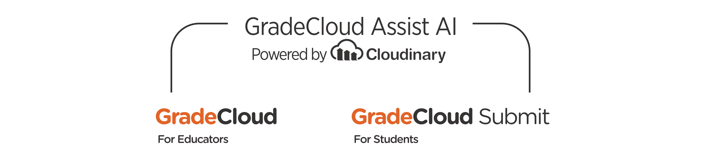
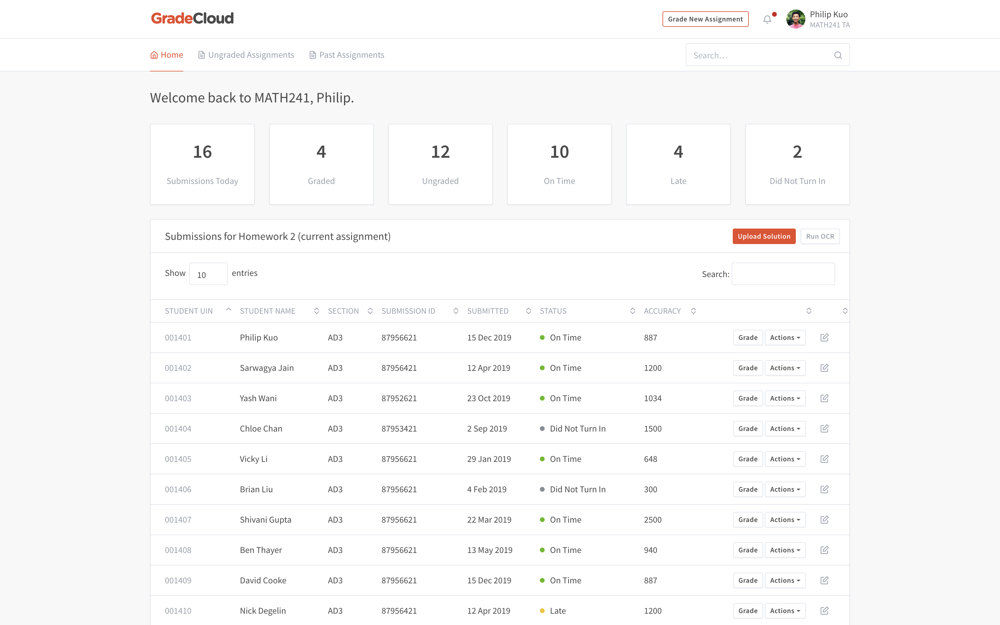
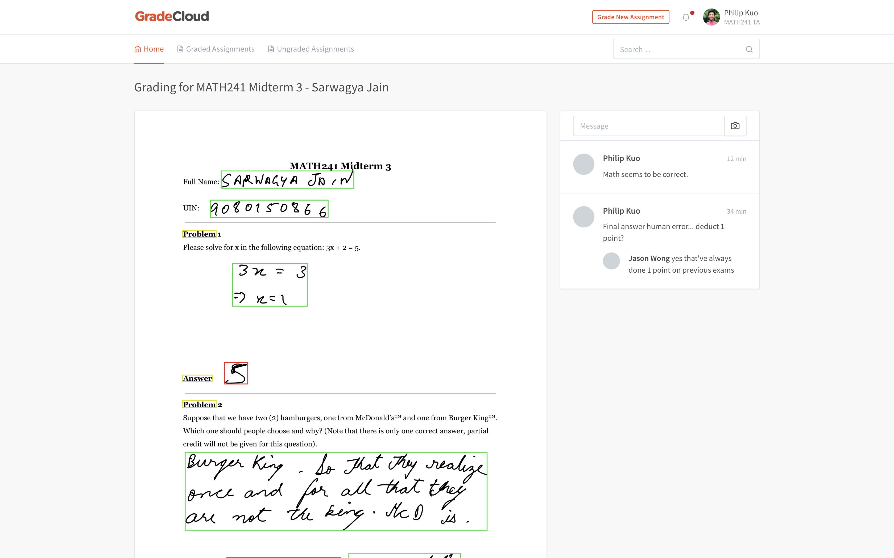

# GradeCloud

GradeCloud is a platform that assist teachers with grading paper-based exams and assignments. We utilize the powerful image recognition and processing APIs provided by Cloudinary to generate helpful insights for teachers so only minimum time is needed on grading complex problems, streamlining the traditional grading process.

This project was built in 24 hours at the Dare Mighty Things Hackathon 2019 in McDonald's HQ in Chicago, IL. *We're one of the winners of the hackathon!*

## About

Higher education institution educators often face the problem of not having the enough manpower to grade hand written exams and assignments efficiently. Due to this delay in submitting the assignment and getting back feedbacks from the instructors, student forget their original train of thoughts, and are not usually able to efficiently go back and review the material written.

We understand that it is a tedious process grading complex engineering exams that involve a lot of write-ups. For most of these exams, the process of going from the question to the answer only varies so much, yet it takes a long time for teachers and TAs to recognize students' handwriting, and it's why these things take so long to grade.

## Our Solution

With the emerging technologies like Cloudinary and Google Cloud Vision AI, we believe that there must be ways that computers can help speed up the grading process of paper exams. That's why we developed GradeCloud Assist AI. 

GradeCloud Assist AI is an algorithm that provides helpful insights of students' assignments to instructors. Empowered by Cloudinary and Google Cloud Vision AI, we read in students' hand-written response to complex questions, and analyzed them based on a number of factors, including comparing them to instructors' correct answer, Wolfram Engine's step by step answers, and etc. 

From there, we are able to generate a precise accuracy score, leveraging the Levenshtein Algorithm to provide instructors an idea of just how well the students are performing, before even looking at their responses. We also provide additional visual guidance to messy hand written responses, so instructors don't get lost in complex responses.

All these powerful analyzed data generated by GradeCloud Assist AI is then presented on our web dashboard interface - they are front-end interfaces called GradeCloud and GradeCloud Submit. GradeCloud is designed to assist instructors even further in grading a large volume of assignments efficiently, truly shorting the submit-to-feedback time cycle; GradeCloud Submit is designed to act as an all-in-one dashboard for students to submit and track their assignments more easily.

With GradeCloud Assist AI, GradeCloud, and GradeCloud Submit, we believe that we have the potential to empower paper exam grading process for educators around the world. 

## This Repository

What is presented on this git repository is solely the front end web interface of the project, which shows the final result of our hours of developments and getting the backend algorithms to work. What's on this repo is only the surface of this entire project - the tip of the iceberg. Since it is not practical to continue hosting the interactive GradeCloud demo on Google Cloud, I have included just the (static) front-end interface for archive and basic demo purposes.

### [GradeCloud Platform Demo](https://pkgamma.github.io/gradecloud/)

## License

GradeCloud is licensed under The MIT License (MIT). Which means that you can use, copy, modify, merge, publish, distribute, sublicense, and/or sell copies of the final products.